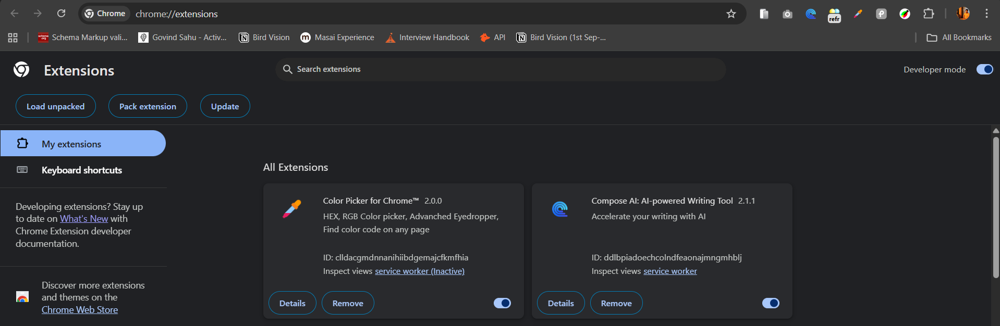
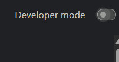
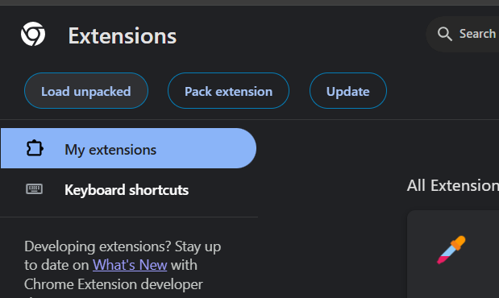
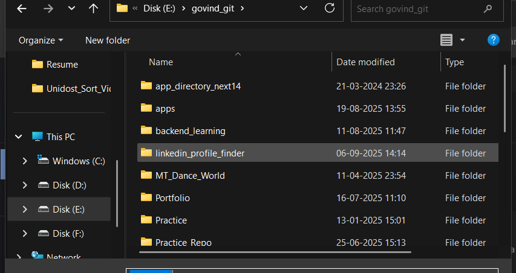
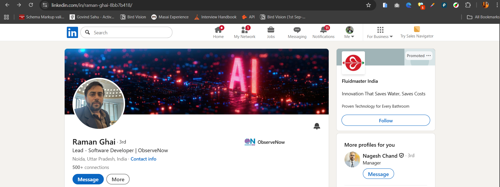
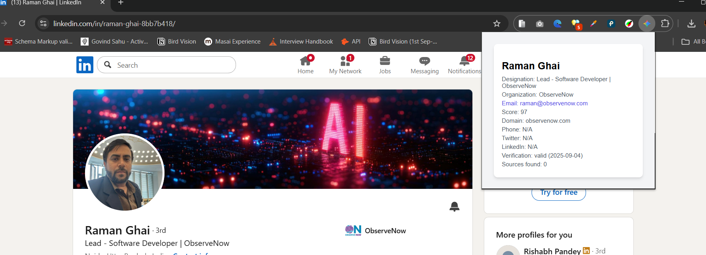
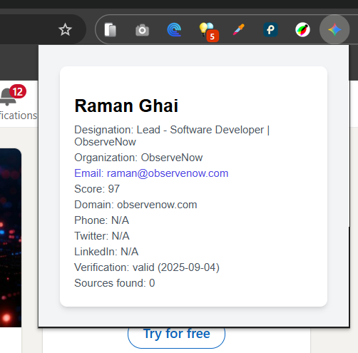
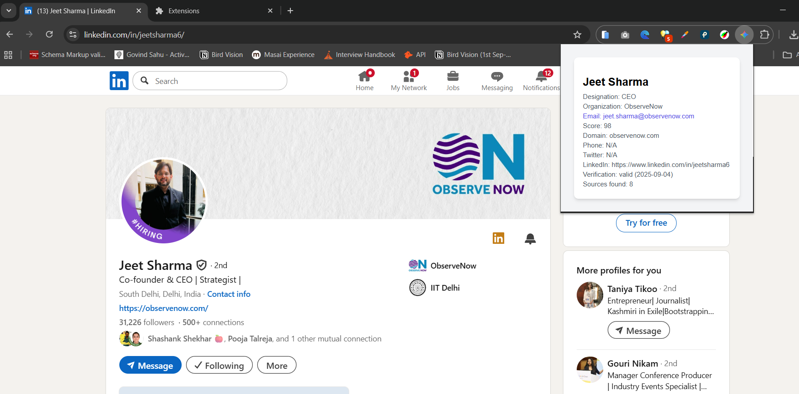
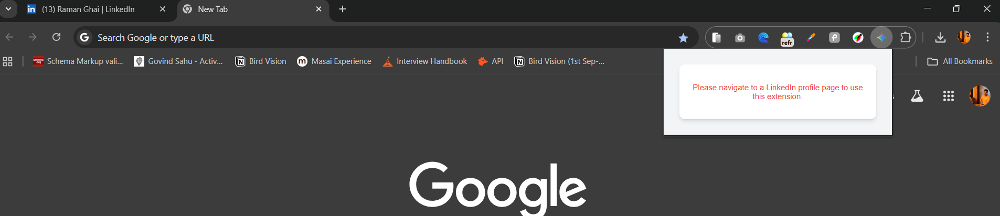
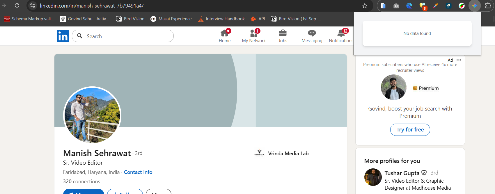

# LinkedIn Profile Finder

A Chrome extension to find and display LinkedIn profile information, including email, company, designation, and more, using the Hunter.io API.

---

## 🚀 Features

- Extracts LinkedIn profile details (name, company)
- Finds professional email addresses using Hunter.io
- Displays verification status, sources, and more
- Clean, responsive UI

---

## 🛠️ Installation

### 1. Clone the Repository

```sh
git clone https://github.com/sgovind158/Linkedin_Profile_Finder.git
cd Linkedin_Profile_Finder
```

### 2. Install Dependencies

No dependencies required for the extension itself.  


### 3. Add Your Hunter.io API Key

- Open `background.js`
- Replace the placeholder in `const hunterIoApiKey = "";` with your [Hunter.io](https://hunter.io/) API key.

**Important:**  
Never commit your API key to a public repository.

---

## 🧩 Load the Extension in Chrome

1. Open Chrome and go to `chrome://extensions/`
2. Enable **Developer mode** (top right)
3. Click **Load unpacked**
4. Select the cloned `Linkedin_Profile_Finder` folder

1. Open Chrome and go to `chrome://extensions/`


2. Enable **Developer mode** (top right)


3. Click **Load unpacked**


4 Select the cloned `Linkedin_Profile_Finder` folder

---

## 📝 Usage

1. Go to any LinkedIn profile page (e.g., `https://www.linkedin.com/in/username/`)
2. Click the **LinkedIn Profile Finder** extension icon in your browser
3. The extension will display the profile's details and email (if found)
4. If you are not on a LinkedIn profile page, the extension will show a message indicating that it only works on LinkedIn profile URLs.
5. If no data is found for the profile, the extension will display a "No data found" message.

1. Go to any LinkedIn profile page


2. Click the **LinkedIn Profile Finder** extension icon in your browser


3. The extension will display the profile's details and email (if found)



4. If you are not on a LinkedIn profile page, the extension will show a message indicating that it only works on LinkedIn profile URLs.


5 If no data is found for the profile, the extension will display a "No data found" message.

---

## ⚠️ Notes

- The extension only works on LinkedIn profile pages (`linkedin.com/in/`)
- You must have a valid Hunter.io API key
- For best results, ensure you are logged in to LinkedIn

---

## 🛡️ Security

- **Never share your API key publicly**
- If you accidentally commit your API key, [remove it from git history](https://docs.github.com/en/authentication/keeping-your-account-and-data-secure/removing-sensitive-data-from-a-repository) and revoke it from Hunter.io

---

## 📄 License

MIT

---

## 🙋‍♂️ Contributing

Pull requests are welcome! For major changes, please open an issue first to discuss what you would like to change.

---

## 📧 Contact

For questions, open an issue or contact [sgovind158](https://github.com/sgovind158).
